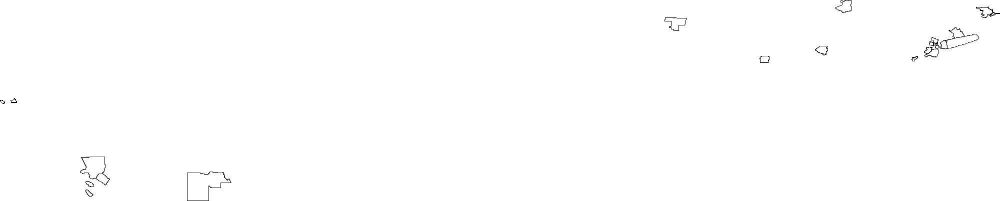
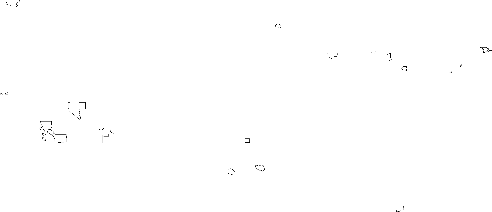
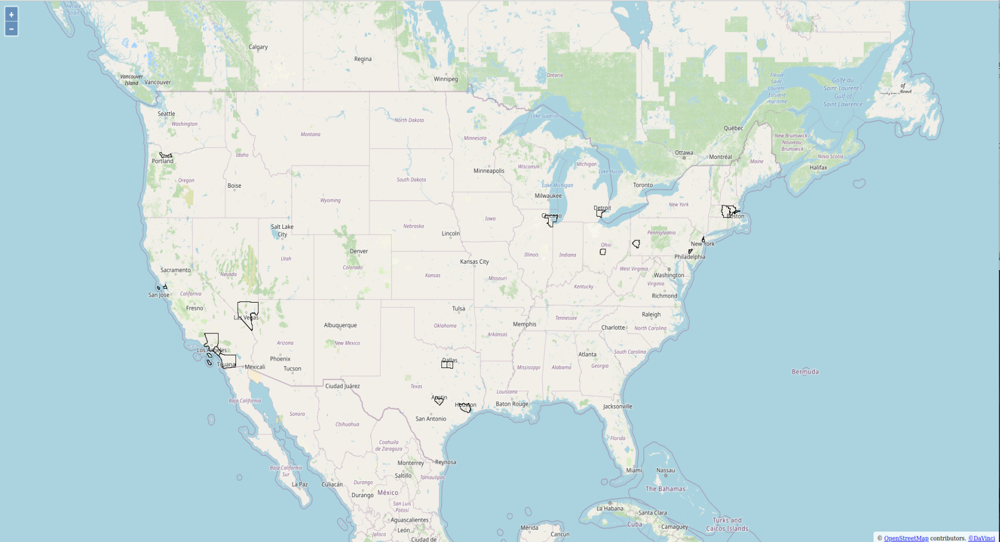
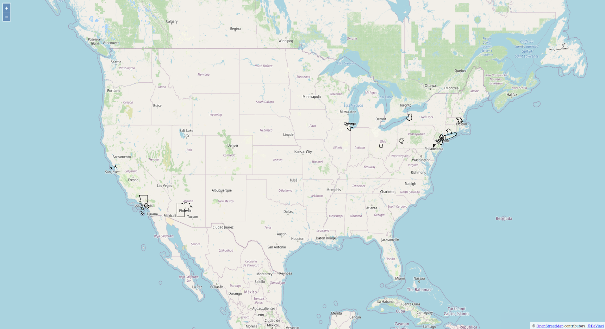
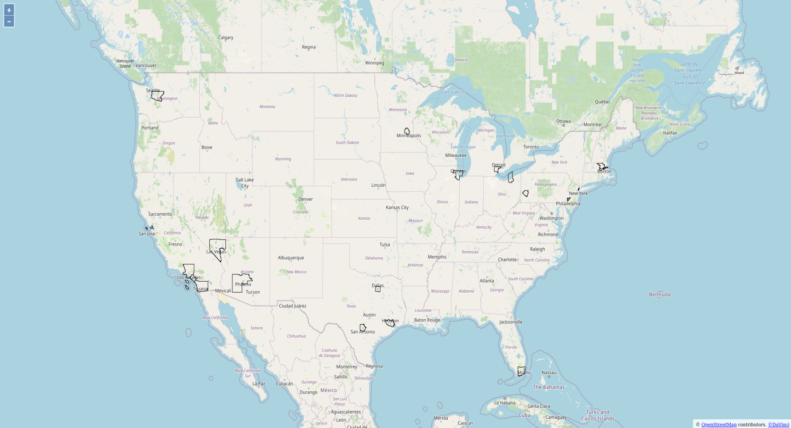

# Lab9

<br/>

## Student Information
- <u>Name</u>: Jianeng Yang
- <u>Email</u>: jyang171@ucr.edu
- <u>NetId</u>: jyang171
- <u>SID</u>: 862039649

<br/>

## Lab Questions
(Q1) Does the result of part III conform to our initial expectations? Why or why not? <bar/>
* Yes, we have 24 data outputs, each of represent number of tweets in each hour of day that tweet has keyword "coffee". (24 hours period e.g.: 1AM-2AM,2AM-3AM,etc)

(Q2) Return the above code for the entire dataset `tweets.csv` and include the result in your README file. <bar/>
```
Number of tweets is 19999952
Number of counties 3233
Number of timezones is 120
2387, 2101, 1973, 1675, 1480, 1268, 1212, 1202, 1047, 1016, 948, 825, 796, 706, 552, 369, 359, 492, 1075, 2243, 3146, 3592, 3261, 2849
```
(Q3) Does this output conform to what we expected earlier? <bar/>
* No, because we consider the timezone in this case and the earlier one we not consider timezone which it's count in the wrong time period.

(Q4) How does the output look for the entire tweets dataset? <bar/>
```
492, 1075, 2243, 3146, 3592, 3261, 2848, 2349, 2121, 1959, 1686, 1483, 1266, 1209, 1220, 1053, 1016, 948, 825, 796, 706, 552, 369, 359
```

(Q5) What is the third keyword that you chose?
* The key word I chose is `window`.


(S1) `counties_donut.png` <bar/>


(S2) `counties_bagel.png` <bar/>



(S3) `counties_window.png` <bar/>



(S4) `counties_donut_multilevelpng`<bar/>



(S5) `counties_bagel_multilevelpng`<bar/>



(S6) `counties_window_multilevelpng`<bar/>


